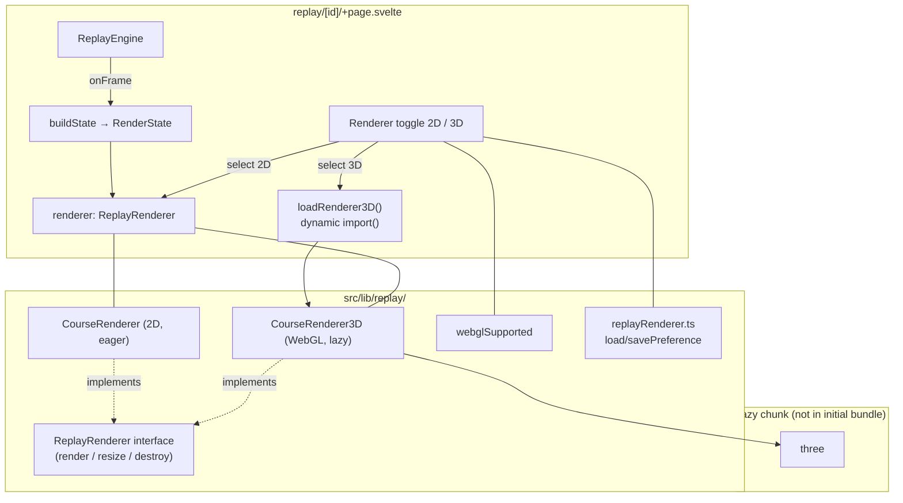

# Design Document: 3D Replay View

## Overview

The 3D replay view adds an optional WebGL renderer alongside the existing 2D
`CourseRenderer`. The two renderers are made interchangeable behind a small
`ReplayRenderer` interface and selected at runtime. 2D is the default; 3D is
opt-in, lazy-loaded on first selection, and falls back to 2D when WebGL is
unavailable or `prefers-reduced-motion` would make it inappropriate.

The key insight from the existing code is that the **renderer is already a clean
seam**. `ReplayEngine` emits a pure `Frame`; the page builds a `RenderState`
(`buildState`) and calls `renderer.render(state, playing, theme)`. The engine,
ghost logic, controls, and seeking are all renderer-agnostic. This feature
introduces **no changes to `engine.ts`, the server, or the data model** — only a
renderer abstraction, a new 3D renderer, a loader, a preference helper, and the
page wiring that switches between them.

## Architecture



## Components

### 1. `ReplayRenderer` interface (`src/lib/replay/renderer.ts`)

Extract the shared contract both renderers satisfy. `CourseRenderer` already
matches it; this is purely additive.

```ts
export interface ReplayRenderer {
	render(state: RenderState, playing: boolean, theme: 'light' | 'dark'): void;
	resize(cssWidth: number, cssHeight: number): void;
	destroy(): void;
}
```

`CourseRenderer` gains an explicit `destroy()` (currently it has none; 2D has no
resources to free, so it is a no-op) and an `implements ReplayRenderer`
declaration. `RenderState`, `AvatarState`, and the `COLORS_*` palettes stay as
the single source of truth — the 3D renderer imports the same palette constants
so colours never drift from `app.css`.

### 2. `webglSupported()` (`src/lib/replay/renderer3dLoader.ts`)

Synchronous capability probe, SSR-safe:

```ts
export function webglSupported(): boolean {
	if (typeof document === 'undefined') return false;
	try {
		const c = document.createElement('canvas');
		return !!(c.getContext('webgl2') || c.getContext('webgl'));
	} catch {
		return false;
	}
}
```

### 3. `loadRenderer3D()` (`src/lib/replay/renderer3dLoader.ts`)

Lazy loader. The `three` import lives **inside** `CourseRenderer3D`'s module, so
the dynamic `import()` of that module is what pulls Three.js into its own chunk —
keeping it out of the dashboard and replay initial bundles (Req 2.1, 2.2). The
loader caches the resolved module so subsequent toggles don't re-import (Req 2.5).

```ts
let cached: Promise<Renderer3DCtor> | null = null;
export function loadRenderer3D(): Promise<Renderer3DCtor> {
	cached ??= import('./renderer3d').then((m) => m.CourseRenderer3D);
	return cached;
}
```

`renderer3d.ts` (the module that imports `three`) is the single lazy boundary;
nothing else in the app imports `three` statically.

### 4. `CourseRenderer3D` (`src/lib/replay/renderer3d.ts`, lazy)

Implements `ReplayRenderer` using Three.js. Mirrors the 2D renderer's
responsibilities in a 3D scene.

**Construction:** takes the same `HTMLCanvasElement` as `CourseRenderer`.
Creates a `WebGLRenderer({ canvas, antialias: true })`, a `PerspectiveCamera`, a
`Scene`, lights, and the avatar meshes. The course geometry is built once and
reused (Req 5.1).

**Scene layout (maps directly from `RenderState`):**

| RenderState field | 3D representation |
|---|---|
| `totalDistance` | length of the course/lane along +Z; distance ticks as posts |
| `distFrac` | live avatar position = `lerp(start, finish, distFrac)` |
| `frame.pace`, `frame.spm` | floating pace label above live avatar; spm drives a subtle bob |
| `ghost?.distFrac` | ghost avatar in a parallel lane (only when ghost present) |
| `ghost?.label` | floating label above ghost |
| finish | checkered plane / gate at course end |

Avatars are low-poly boat-like meshes (live uses `--live`, ghost uses `--ghost`,
read from the shared palette). The camera follows the live avatar with a smooth
chase offset; on `seek`/pause it snaps to the new position via the next
`render()` call. Pace/label text is rendered as sprites (canvas-texture or a
lightweight SDF) to avoid pulling a font-geometry dependency.

**`render(state, playing, theme)`:**
1. On theme change, swap material colours to the matching `COLORS_*` palette (Req 4.6).
2. Update avatar positions from `distFrac` (and ghost).
3. Update pace/label sprite textures only when their text changes (not every frame).
4. Advance decorative water/wake only when `playing && !prefersReducedMotion()`
   (reuse the same module-level `matchMedia` pattern as 2D) (Req 3.3, 3.4).
5. Update the chase camera, then `renderer.render(scene, camera)`.

Because the page already calls `render()` once per engine frame *and* on pause,
seek, and theme change, `CourseRenderer3D` does **not** own its own rAF loop — it
draws one frame per `render()` call, exactly like the 2D renderer. This
satisfies Req 5.3 (no idle loop when paused) for free.

**`resize(w, h)`:** cap dpr at `min(devicePixelRatio, 2)` (Req 5.2), set renderer
size and camera aspect. The page already drives larger heights when a ghost is
active (`resize(w, ghostActive ? 190 : 150)`); 3D honours the same dimensions.

**`destroy()`:** dispose geometries, materials, textures, and call
`renderer.dispose()` / lose the context (Req 5.4). Called when switching back to
2D or on workout change / unmount.

### 5. `replayRenderer.ts` (pure preference helper)

Follows the `liveMode.ts` pattern — pure, testable, localStorage-backed:

```ts
export type RendererKind = '2d' | '3d';
export function loadRendererPref(): RendererKind;   // default '2d'
export function saveRendererPref(k: RendererKind): void;
```

A cookie mirror is **not** required (unlike live mode) because the renderer is
chosen client-side after mount; SSR always renders the 2D-ready canvas markup.

### 6. Page wiring (`src/routes/replay/[id]/+page.svelte`)

Changes are localized to the renderer lifecycle already at lines ~119–252.

- `let renderer: ReplayRenderer | null` (was `CourseRenderer | null`).
- Add `$state` for `rendererKind`, `loading3d`, `webglOk` (computed once via `webglSupported()`), and `Ctor3D` (cached constructor once loaded).
- A `setRenderer(kind)` helper:
  - Destroys the current renderer.
  - For `'2d'`: `new CourseRenderer(canvasEl)`.
  - For `'3d'`: if `Ctor3D` is cached, construct immediately; else set `loading3d = true`, `await loadRenderer3D()`, construct, clear loading. On import or init failure: catch, revert `rendererKind = '2d'`, build 2D, surface an i18n error (toast).
  - After construction: `resize(...)` to current `courseWrap` dims, then `renderCurrent()`.
- The engine `onFrame` callback and `renderCurrent()` are unchanged — they call `renderer?.render(...)` against the interface.
- **Switching preserves playback** (Req 1.5): time/playing/speed live in `engine`/`$state`, not the renderer, so swapping the renderer and calling `render(buildState(frame), playing, theme)` resumes seamlessly.
- On mount: read `loadRendererPref()`; if `'3d'` and `webglOk`, select 3D (which lazy-loads); otherwise 2D. The workout-change `$effect` constructs whichever kind is currently active instead of hard-coding `CourseRenderer`.

### 7. Toggle UI

A small segmented control / button pair near the replay canvas:

- Labels via `i18n.t()` (`replay.view2d`, `replay.view3d`).
- The 3D option is `disabled` (with an explanatory `title`) when `!webglOk` (Req 3.2), and shows a spinner while `loading3d` (Req 2.3).
- Keyboard operable and `aria-pressed`/grouped labelling for AT (Req 3.5).

## Library Choice

**Three.js**, lazy-loaded.

| Option | Verdict |
|---|---|
| **Three.js** | Chosen. Mature, ergonomic, tree-shakeable; ~150 KB gzipped — acceptable *because it is in a lazy chunk only loaded on opt-in*. Fast path to a low-poly boat/course scene. |
| Raw WebGL / WebGPU | Smallest bytes, but large hand-written effort for camera, lighting, text; WebGPU support uneven on the WebKit e2e target. Rejected for v1. |
| Babylon.js | Heavier than Three for this scope. Rejected. |

Three is added as a dependency but **never statically imported** outside
`renderer3d.ts`, so the bundle-size constraint (Req 2.2) is enforced structurally.
A build check (or a comment + lint convention) guards against accidental static
imports of `three` elsewhere.

## Accessibility & Theming

- Decorative motion (water/wake) is suppressed under `prefers-reduced-motion`,
  reusing the exact module-level `matchMedia` approach in `renderer.ts:5-17`.
  Data-driven avatar movement remains because it is user-initiated playback
  (consistent with the existing comment) (Req 3.3, 3.4).
- Theme palette is read from the shared `COLORS_LIGHT` / `COLORS_DARK` constants;
  the existing theme `$effect` (`+page.svelte:143`) re-invokes `render()`, so the
  3D renderer recolours on toggle with no extra wiring (Req 4.6).
- WebGL probe failure disables the 3D option rather than offering a broken view
  (Req 3.2); init/runtime throw reverts to 2D (Req 3.6).

## Performance

- Scene geometry precomputed once per workout (Req 5.1); per-frame work is
  position/camera/material updates only.
- dpr capped at 2 (Req 5.2); one draw per `render()` call, none while paused
  (Req 5.3).
- Full GPU resource disposal on renderer swap / unmount (Req 5.4).
- Detail budget tuned for a single-avatar scene on mid-range mobile; ghost adds
  one mesh + one label. Fidelity favours clean low-poly over realistic water
  (Req 5.5).

## Testing

- **Unit (Vitest):**
  - `replayRenderer.test.ts` — preference load/save defaults to `'2d'`.
  - `renderer3dLoader.test.ts` — `webglSupported()` returns false with no canvas/context (mock `document`); `loadRenderer3D()` caches.
  - Existing `renderer.test.ts` unchanged (2D still default) and the new
    `implements ReplayRenderer` keeps it type-checked (Req 7.3).
- **Type:** `npm run check` verifies both renderers satisfy `ReplayRenderer`.
- **E2E (WebKit):** existing replay flow stays on 2D and must pass unchanged. A
  new spec toggles to 3D, asserts the canvas is present and the toggle reflects
  state; pixel assertions are avoided (Req 7.2, 7.3). Where WebKit lacks WebGL in
  CI, the test asserts the 3D option is disabled (exercising the fallback,
  Req 7.4).
- **Demo mode:** all of the above run against `mockData` with no credentials
  (Req 7.1).

## i18n

New keys added to **all** locale files in `src/lib/locales/` (`en`, `zh`, `de`,
`es`, `fr`, `ja`) and validated by `npm run validate:locales`:

- `replay.view2d`, `replay.view3d` — toggle labels.
- `replay.view3dUnsupported` — tooltip when WebGL is unavailable.
- `replay.view3dLoading` — loading indicator.
- `replay.view3dError` — load/init failure message.

Sport names (RowErg, SkiErg, BikeErg) rendered in the scene remain untranslated
(Req 8.3).

## File Manifest

| File | Change |
|---|---|
| `src/lib/replay/renderer.ts` | Add `ReplayRenderer` interface; `CourseRenderer implements` it + no-op `destroy()` |
| `src/lib/replay/renderer3dLoader.ts` | New — `webglSupported()`, `loadRenderer3D()` |
| `src/lib/replay/renderer3d.ts` | New — `CourseRenderer3D` (only module importing `three`) |
| `src/lib/replay/replayRenderer.ts` | New — preference type + load/save |
| `src/routes/replay/[id]/+page.svelte` | Renderer becomes `ReplayRenderer`; toggle UI; `setRenderer`; mount/workout-change wiring |
| `src/lib/locales/*.ts` | New `replay.view*` keys in all 6 locales |
| `package.json` | Add `three` (+ `@types/three` dev) |
| `*.test.ts` | New loader/preference unit tests; new optional e2e toggle spec |
