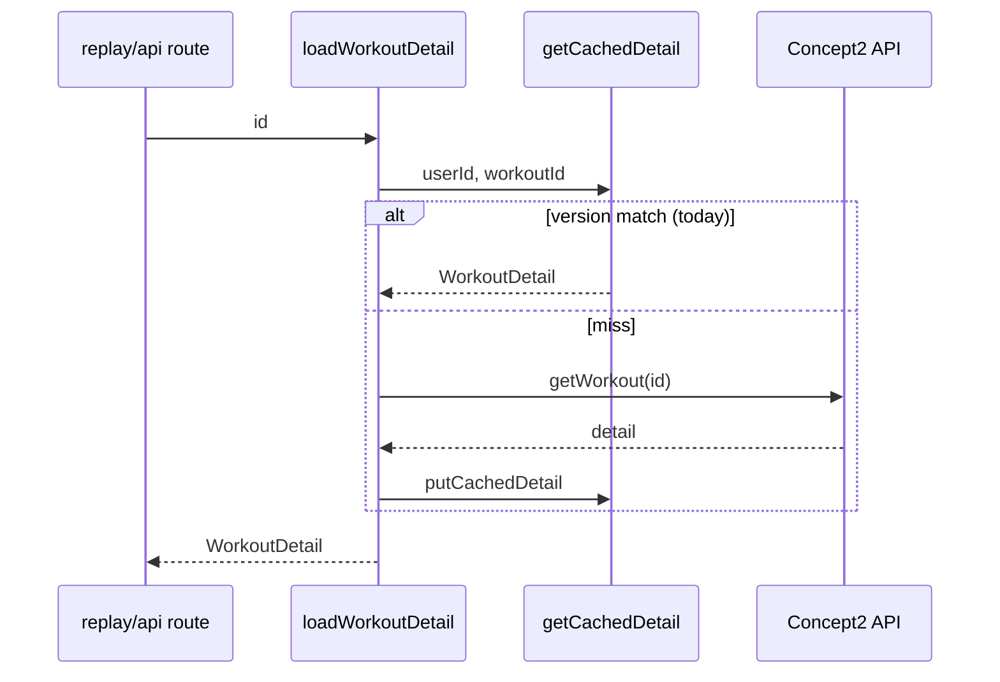
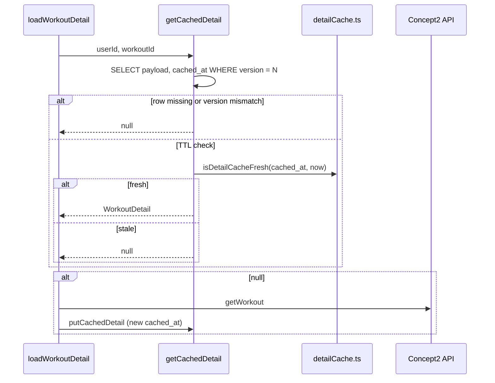

# Design: Detail-cache TTL and re-hydration

## Overview

Extend the existing D1 detail cache in `src/lib/server/db.ts` with a time-based freshness check alongside `DETAIL_PAYLOAD_VERSION`. Policy constants and pure helpers live in a new `src/lib/server/detailCache.ts` module for unit tests. Authenticated loads in `loadWorkoutDetail` already re-fetch on cache miss; no route changes required.

## Current flow

Today `getCachedDetail` filters only on `payload_version`. Rows with matching version are returned regardless of `cached_at`.

## Proposed flow

## Components

| Module           | Responsibility                                                                                    |
| ---------------- | ------------------------------------------------------------------------------------------------- |
| `detailCache.ts` | `DETAIL_CACHE_TTL_MS`, `detailCacheTtlMs(env?)`, `isDetailCacheFresh(cachedAt, nowMs, ttlMs?)`    |
| `db.ts`          | `getCachedDetail` selects `cached_at`, applies freshness; `getCachedDetailByShareToken` unchanged |
| `data.ts`        | No change (miss triggers existing re-hydration)                                                   |

## Configuration

- **Default:** `7 * 24 * 60 * 60 * 1000` ms (seven days).
- **Optional override:** `DETAIL_CACHE_TTL_DAYS` in Worker `vars` (integer string). Parsed in `detailCacheTtlMs`; invalid or non-positive values fall back to default.
- Add binding to `src/app.d.ts` `Platform.env` as optional string.

No `wrangler.jsonc` change required for demo; operators can set the var when deploying.

## Data model

No migration. Existing columns:

- `cached_at` — epoch ms, already written on upsert.
- `payload_version` — unchanged from PR #18.

Stale rows may remain in D1 until overwritten on next load or user data purge; TTL only affects read path.

## Share token path

`getCachedDetailByShareToken` continues to return payload without TTL check. Rationale: anonymous readers cannot call Concept2. Owner re-open after TTL refreshes the row including any `share_token` column.

## Error handling

- Unchanged: try/catch in `getCachedDetail` returns `null` on D1 failure → Concept2 fetch.
- `JSON.parse` failures already yield null via catch.

## Testing strategy

| Layer       | What                                                                           |
| ----------- | ------------------------------------------------------------------------------ |
| Unit        | `detailCache.test.ts` — freshness boundaries, env override parsing             |
| Integration | Existing `loadWorkoutDetail` path covered indirectly; no D1 in Vitest          |
| Manual      | With D1 + auth: set `cached_at` in past in local DB, confirm replay re-fetches |

## Correctness properties

1. Fresh cache + matching version ⇒ no Concept2 call (existing behaviour preserved within TTL).
2. Version mismatch ⇒ miss even if `cached_at` is fresh.
3. TTL expiry ⇒ miss even if version matches.
4. Share lookups never return null solely due to TTL.
