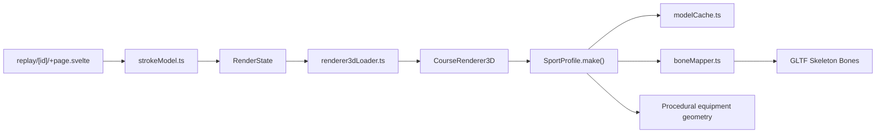

# Design Document: GLTF Avatar Upgrade

## Overview

The current 3D avatar is a ball-and-stick skeleton of ~20 meshes (ellipsoids,
capsules, boxes) that looks identical at every quality tier. This upgrade
replaces the procedural human body with rigged GLTF models sourced from Mixamo,
driven by the existing IK animation system through a new bone-mapper layer.

Sport-specific equipment (boat hull, oars, skis, poles, bike frame, wheels)
remains procedural Three.js geometry — those shapes are simple and look fine.

## Flow



## Model sourcing

Athlete models are sourced from Mixamo (free rigged humanoid models) and
converted from FBX to GLB format. Two variants:

- `static/models/athlete.glb` — full-detail model for High/Ultra quality
  (~500KB–1MB)
- `static/models/athlete-low.glb` — reduced-poly model for Low/Medium quality
  (~200KB)

Mixamo keyframe animations are stripped at conversion time. We drive the
skeleton procedurally via the bone mapper. The model includes a standard Mixamo
skeleton (`mixamorig:Hips`, `mixamorig:Spine`, `mixamorig:LeftUpLeg`, etc.).

Skin/clothing customization uses runtime material property overrides (color,
roughness) — same accent parameter system as today. No texture swapping.

## Model cache

`src/lib/replay/modelCache.ts` handles GLTF loading and caching:

- Loads models via Three.js `GLTFLoader`
- Caches by URL so the same model is never loaded twice
- Returns a cloned scene per avatar instance (live lane + ghost lane)
- Quality config selects which model variant to load

## Bone mapper

`src/lib/replay/boneMapper.ts` is the core new system. It bridges the existing
IK target-position code to GLTF skeleton bone rotations.

The mapper:

1. Traverses the GLTF skeleton, caches `Bone` references by name
2. Receives IK target positions each frame (shoulder, elbow, hand, hip, knee,
   foot — same `Point3` arrays the current code computes)
3. Computes bone rotations using two-bone IK for limbs and direct look-at for
   spine/head
4. Applies to `Bone.quaternion`

Key bone mappings:

| IK Target            | Bone(s)                   | Method              |
| -------------------- | ------------------------- | ------------------- |
| Hip position         | `Hips`                    | Direct position     |
| Torso layback        | `Spine`, `Spine1`         | Distributed rotation |
| Shoulder → Elbow → Hand | `Arm`, `ForeArm`       | Two-bone IK         |
| Hip → Knee → Foot    | `UpLeg`, `Leg`            | Two-bone IK         |
| Head orientation     | `Head`                    | Look-at from torso  |

Sport-specific `animate()` functions stay as the animation source. They output
IK target positions (same as today) instead of directly moving meshes.

## Sport accessories (unchanged)

Equipment remains procedural Three.js geometry, added to the same `THREE.Group`
as the GLTF model:

- **RowErg**: hull (capsule), deck (box), stripe (box), foot plate (box), oars
  (cylinder shafts + box blades), collars (torus)
- **SkiErg**: skis (boxes), ski tips (boxes), boots (boxes), poles (cylinder
  shafts), baskets (cylinders)
- **BikeErg**: wheels (torus + box spokes), diamond frame (boxes), cranks,
  chain ring (torus), pedals (boxes), helmet (ellipsoid)

Equipment is positioned relative to the skeleton's root bone or to IK target
positions (hands on oar handle, feet on pedals, etc.).

## Quality tier integration

`QualityConfig` gains a new field:

```ts
avatarModel: "low" | "high";
```

| Tier   | Avatar Model     | Shadows | Shadow Map |
| ------ | ---------------- | ------- | ---------- |
| Low    | athlete-low.glb  | No      | 0          |
| Medium | athlete-low.glb  | No      | 0          |
| High   | athlete.glb      | Yes     | 1024       |
| Ultra  | athlete.glb      | Yes     | 2048       |

The performance governor still owns degradation. If the governor demotes
quality, the avatar model does not hot-swap (that would require reloading) —
the governor affects environment detail, not the loaded model.

## Reduced motion

No change. Reduced motion suppresses decorative animation and particle effects.
The bone mapper still computes rotations so the skeleton stays in a valid pose,
but splash, spray, surge, wave displacement, and FOV zoom remain suppressed.

## Migration strategy

1. Add `GLTFLoader` dependency (already bundled with Three.js)
2. Create `modelCache.ts` — model loading + caching
3. Create `boneMapper.ts` — skeleton IK driver
4. Download/convert Mixamo model → `static/models/athlete.glb` +
   `athlete-low.glb`
5. Refactor `makeRowerAvatar` → loads GLTF model + keeps procedural accessories
6. Same for skier and cyclist
7. Update `QualityConfig` with `avatarModel` field
8. Remove old ellipsoid/capsule body construction code
9. Update tests

## Files changed

| File                                    | Change                                                 |
| --------------------------------------- | ------------------------------------------------------ |
| `src/lib/replay/modelCache.ts`          | New GLTF model loader + cache                          |
| `src/lib/replay/modelCache.test.ts`     | Tests for model loading and caching                    |
| `src/lib/replay/boneMapper.ts`          | New skeleton bone IK driver                            |
| `src/lib/replay/boneMapper.test.ts`     | Tests for bone mapping and two-bone IK                 |
| `src/lib/replay/renderer3d.ts`          | Refactor avatar construction to use GLTF + bone mapper |
| `src/lib/replay/renderer3d.test.ts`     | Updated 3D renderer tests                              |
| `src/lib/replay/renderer3dLoader.ts`    | Quality-gated model selection                          |
| `static/models/athlete.glb`            | Full-detail rigged humanoid model                      |
| `static/models/athlete-low.glb`        | Low-poly rigged humanoid model                         |
| `.kiro/steering/structure.md`           | Replay module inventory update                         |
