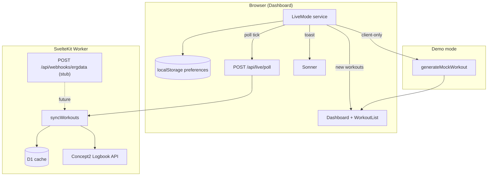
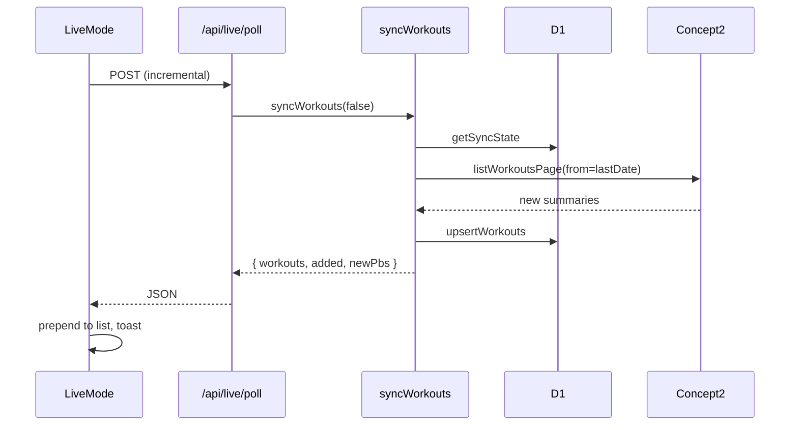

# Design Document: Live/Near-Live Mode

## Overview

Live mode adds a client-side polling subsystem that periodically triggers incremental logbook syncs. New workouts surface on the dashboard via optimistic list updates and toast notifications — no manual sync button required after every piece.

The architecture separates **data sources** (how workouts arrive) from **presentation** (dashboard UI, toasts, preferences). Polling is the initial source; an ErgData webhook endpoint is stubbed for future real-time delivery.

## Architecture



## Components

### 1. `src/lib/liveMode.ts` (pure)

Stateless helpers shared by client and tests:

- `LiveModePrefs` — `{ enabled, intervalSec, soundEnabled, source: 'poll' | 'webhook' }`
- Interval presets: `30 | 60 | 120 | 300` seconds
- `loadPrefs()` / `savePrefs()` — localStorage + cookie mirror for SSR hints
- `nextBackoffMs(failures)` — exponential backoff: 30s → 60s → 120s → 300s cap
- `effectiveInterval(baseSec, tabVisible)` — active tab uses configured interval; hidden tab uses `max(base, 5min)`
- `LivePollResult` — `{ workouts, added, newPbs, error? }`

### 2. `src/lib/liveMode.svelte.ts` (reactive service)

`LiveMode` class (context on dashboard, not global singleton):

| State          | Purpose                                 |
| -------------- | --------------------------------------- |
| `enabled`      | User toggle                             |
| `intervalSec`  | Polling interval preset                 |
| `polling`      | In-progress indicator                   |
| `lastPollAt`   | Last successful poll timestamp          |
| `nextPollAt`   | Scheduled next poll                     |
| `failures`     | Consecutive error count (warning at ≥3) |
| `soundEnabled` | Optional notification chime             |

**Lifecycle:**

1. `start()` — arm single `setTimeout` chain (no duplicate timers)
2. `poll()` — POST `/api/live/poll` (auth) or client mock generation (demo)
3. On success — reset failures, emit `onWorkouts(workouts, newPbs)`, schedule next tick
4. On error — increment failures, toast, apply backoff
5. `visibilitychange` — immediate poll on focus; cancel in-flight fetch on blur
6. `stop()` — clear timer, abort pending request (logout / disable / unmount)

Manual sync calls `liveMode.resetTimer()` so the next auto-poll waits a full interval.

### 3. Server: extend `syncWorkouts`

Return newly upserted workout summaries in `SyncResult.workouts` so the client can prepend without a full page reload.

Deduplication is already handled by `upsertWorkouts` (INSERT OR REPLACE on workout id).

### 4. `POST /api/live/poll`

Thin wrapper around incremental `syncWorkouts(event, false)`:

```typescript
{ workouts: Workout[], added: number, total: number, newPbs: DistancePB[] }
```

Returns 401 when unauthenticated; in demo mode returns `{ workouts: [], added: 0 }` (demo polling is client-side).

### 5. `POST /api/webhooks/ergdata` (stub)

Validates `ERGDATA_WEBHOOK_SECRET` HMAC signature header when configured. Parses `{ workoutId }`, triggers detail fetch + cache. Returns 501 when secret unset — documents future path without activating polling replacement yet.

Preference `source: 'webhook'` is stored but falls back to poll until webhook is configured server-side.

### 6. Demo mock poller

`generateMockWorkout(existingIds)` in `mockData.ts` produces a realistic summary + detail using the existing stroke synthesiser. Mock poller runs entirely client-side with random delay 30s–3min.

### 7. Dashboard integration

- `LiveModePanel.svelte` — toggle, interval selector, last/next poll times, polling spinner, failure warning
- Dashboard holds `extraWorkouts` client state merged with SSR `data.workouts`
- On new workouts: prepend matching filter, animate via `.row-new` CSS, update PB badges
- Debounce batched arrivals within 1s into one toast

### 8. Notifications

Uses existing `svelte-sonner` + i18n keys under `liveMode.*`:

- Single workout: distance, time, sport + "View" action → `/replay/{id}`
- Multiple: count summary toast
- Errors: unreachable API, rate limit, re-auth (401), recovery success
- Optional sound: short Web Audio beep when `soundEnabled`

## Data flow (auth mode)



## Error handling

| Condition               | Behaviour                                        |
| ----------------------- | ------------------------------------------------ |
| HTTP 401                | Stop polling, toast re-auth                      |
| HTTP 429 / rate limit   | Warning toast, backoff to 300s                   |
| Network error           | Error toast with retry hint, exponential backoff |
| D1 unavailable (503)    | Toast error, continue polling                    |
| 3+ consecutive failures | Warning icon on live mode panel                  |

## Testing strategy

- **Unit tests** (`liveMode.test.ts`): backoff math, effective interval, pref round-trip
- **Manual / demo**: enable live mode, wait for mock workout, verify toast + list prepend
- **E2E** (optional follow-up): Playwright with mocked `/api/live/poll` responses

## Non-goals (this iteration)

- Push notifications / service worker background sync
- ErgData webhook activation (stub only)
- Cross-tab leader election (single-tab timer is sufficient per requirements)

## Requirements traceability

| Req                  | Design section                                  |
| -------------------- | ----------------------------------------------- |
| R1 Automatic polling | LiveMode service + `/api/live/poll`             |
| R2 User controls     | LiveModePanel + prefs persistence               |
| R3 Notifications     | Sonner toasts + optional sound                  |
| R4 Demo mode         | Client mock poller + generateMockWorkout        |
| R5 Optimistic UI     | extraWorkouts merge + CSS animation             |
| R6 Webhook support   | Data source abstraction + stub endpoint         |
| R7 State management  | visibility, manual sync reset, dedup via upsert |
| R8 Performance       | single timer, abort on blur, debounce toasts    |
| R9 Error handling    | backoff table + failure counter                 |
| R10 i18n             | `liveMode.*` dictionary keys                    |
