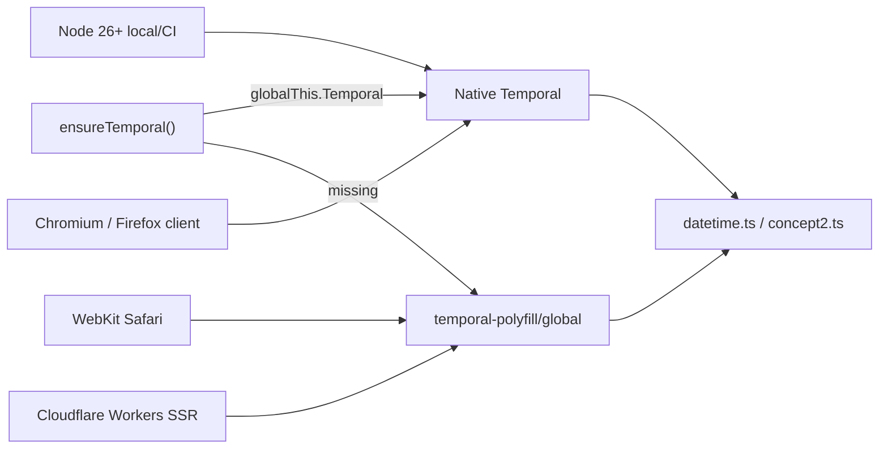
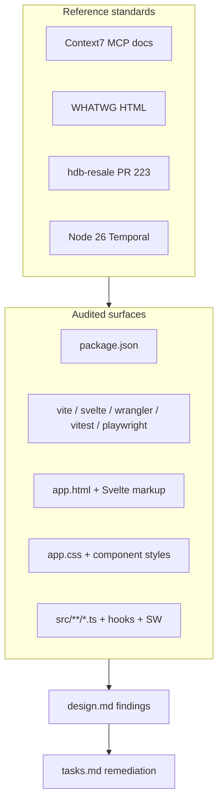

# Design: Platform & Stack Modernization Audit

## Overview

rowplay (audit date: June 2026) is **already on a bleeding-edge stack** (Svelte 5.56, SvelteKit 2.61, Vite 8, Tailwind 4.3, TypeScript 6, Vitest 4, Wrangler 4, Playwright 1.60, Three r184). The codebase uses Svelte 5 runes throughout; no Svelte 4 syntax was found in `src/`.

The audit found **no widespread outdated syntax**. Gaps fall into four buckets:

1. **Dead dependencies** — packages in `package.json` never imported
2. **Deprecated APIs** — `$app/stores` (SvelteKit 2.12+)
3. **Platform features not yet adopted** — HTML/CSS/JS capabilities available in 2026
4. **Cross-project CSS modernization** — features already shipped in hdb-resale-visualizer PR #223 but not rowplay

This document is the **canonical findings record**. Implementation is tracked in `tasks.md`.

---

## 1. Package.json — dependency audit

Audited against Context7 current documentation. Version pins are aggressive and appropriate for June 2026.

### 1.1 Dependencies

| Package | Version | Verdict | Usage / notes |
|---------|---------|---------|---------------|
| `@lucide/svelte` | ^1.17 | ✅ | Tree-shakable named imports; `{size}`, `{strokeWidth}`. Optional: subpath `@lucide/svelte/icons/name` for max tree-shaking |
| `@tailwindcss/vite` | ^4.3 | ✅ | Plugin in `vite.config.ts` before `sveltekit()` |
| `@tanstack/svelte-virtual` | ^3.13 | ✅ | `createVirtualizer` in `WorkoutList.svelte`; intentional `get()` from `svelte/store` to avoid `effect_update_depth_exceeded` |
| `bits-ui` | ^2.18 | ❌ | **Zero imports in `src/`** — dead dependency |
| `clsx` | ^2.1 | ❌ | **Zero imports in `src/`** — dead dependency |
| `svelte-sonner` | ^1.1 | ✅ | `<Toaster>` in `+layout.svelte`; `toast.*` across dashboard/replay/settings/PWA |
| `tailwind-merge` | ^3.6 | ❌ | **Zero imports in `src/`** — dead dependency |
| `tailwindcss` | ^4.3 | ✅ | `@import 'tailwindcss'` in `app.css`; no `tailwind.config.js` |
| `temporal-polyfill` | ~0.3 | ✅ | Conditional load in `ensure-temporal.ts`; types via `app.d.ts` |
| `three` | ^0.184 | ✅ | `import * as THREE`; `WebGLRenderer({ canvas })`; geometry/material disposal in `renderer3d.ts` |
| `uplot` | ^1.6 | ✅ | `setData`, `setSize`, `destroy`, `ResizeObserver`, `hooks.draw`; accessible `role="img"` wrapper |

### 1.2 DevDependencies

| Package | Version | Verdict | Usage / notes |
|---------|---------|---------|---------------|
| `@cloudflare/workers-types` | ^4.20260601 | ✅ | `app.d.ts` Platform.env bindings |
| `@playwright/test` | ^1.60 | ✅ | `webServer` + `wrangler dev`; WebKit + iPhone 14 projects |
| `@sveltejs/adapter-cloudflare` | ^7.2 | ✅ | Assets binding; `.svelte-kit/cloudflare` output |
| `@sveltejs/kit` | ^2.61 | ⚠️ | Typed loads/handlers correct; **`$app/stores` still used in 3 files** |
| `@sveltejs/vite-plugin-svelte` | ^7.1 | ✅ | `vitePreprocess()` |
| `@types/node` | ^25.9 | ✅ | Scripts/tests |
| `@types/three` | ^0.184 | ✅ | 3D renderer |
| `daisyui` | ^5.5 | ✅ | `@plugin "daisyui"` + `@plugin "daisyui/theme"` in `app.css` |
| `svelte` | ^5.56 | ✅ | Runes everywhere |
| `svelte-check` | ^4.4 | ✅ | Quality gate |
| `typescript` | ^6.0 | ✅ | Strict typing |
| `vite` | ^8.0 | ✅ | ESM, Tailwind + SK plugins |
| `vitest` | ^4.1 | ✅ | `defineConfig` from `vitest/config`; node environment |
| `wrangler` | ^4.95 | ⚠️ | Uses `nodejs_als` not Cloudflare auto-template `nodejs_compat` — intentional if ALS-only; revisit if Node APIs missing |

### 1.3 Configuration files

| File | Verdict |
|------|---------|
| `vite.config.ts` | ✅ `@tailwindcss/vite()` + `sveltekit()` |
| `svelte.config.js` | ✅ `adapter-cloudflare`, `$components` alias, service worker registered |
| `vitest.config.ts` | ✅ SvelteKit plugin, `setupFiles`, node env |
| `playwright.config.ts` | ✅ Real Workers runtime on port 8787, not vite dev |
| `wrangler.jsonc` | ✅ ASSETS + KV + D1 bindings; observability enabled |

---

## 2. Svelte & SvelteKit patterns

### 2.1 Svelte 5 — confirmed modern

- `$props()`, `$state`, `$derived`, `$derived.by`, `$effect`, `$props.id()`
- Event handlers: `onclick`, `onchange`, `oninput`, `onsubmit` (not `on:click`)
- `{#snippet}` / `{@render}` in `WorkoutList.svelte`, `{@render children()}` in layout
- `createContext()` for `I18n` and `Theme` (SSR-safe)
- `enhance` from `$app/forms` on token auth form
- No `export let`, `$:`, `createEventDispatcher`, `$$props`, `svelte:component`

### 2.2 SvelteKit 2 — action needed

**Deprecated:** `$app/stores` → migrate to `$app/state` (since SK 2.12; removal planned for SK 3)

| File | Usage |
|------|-------|
| `src/routes/+layout.svelte` | `$page.url.pathname` for nav active state |
| `src/routes/replay/[id]/+page.svelte` | `$page.url.searchParams` for ghost params |
| `src/routes/leaderboard/+page.svelte` | `$page.url.searchParams` for sport/distance filters |

Migration: `import { page } from '$app/state'`; use `page.data` / `page.url` without `$` prefix.

### 2.3 Server patterns — confirmed modern

- `PageServerLoad`, `RequestHandler`, `Actions` with generated `$types`
- `json()`, `fail()`, `throw redirect(303, …)`
- Cookies always set with explicit `path: '/'`
- Security headers in `hooks.server.ts` with immutable-header fallback

---

## 3. HTML audit (WHATWG)

### 3.1 Current strengths (`app.html` + routes)

- `<!doctype html>`, dynamic `%lang%` and `%theme%` on `<html>`
- `viewport-fit=cover`; split `theme-color` meta with `prefers-color-scheme` media queries
- `preconnect` + `crossorigin="anonymous"` for Google Fonts
- PWA manifest + apple-touch-icon
- `data-sveltekit-preload-data="hover"`
- `display: contents` body wrapper (SvelteKit standard)
- Semantic regions: `header`, `main`, `footer`, `nav`, `section`
- Form controls: `type="search"`, `type="date"`, `type="range"`, `type="file"` + `accept`
- Strong ARIA: `aria-label`, `aria-expanded`, `aria-pressed`, `aria-live`, `role="group"`, `role="status"`, `role="img"` on charts
- Replay keyboard: Space to play/pause (with input/button exclusion)
- No `@html`, no `innerHTML`, no `document.write`

### 3.2 Gaps — native HTML not yet used

| Feature | Current approach | Recommended |
|---------|------------------|-------------|
| Mobile nav drawer | Custom `menuOpen` + scrim + Escape listener in `+layout.svelte` | `<dialog closedby="any">` |
| Filter expand/collapse | `expanded` state in `WorkoutListFilters.svelte` | `
` / `
` |
| Delete confirmation | `window.confirm()` in `AnnotationPanel.svelte` | `<dialog method="dialog">` |
| Share replay | Clipboard only in `shareReplay()` | `navigator.share()` then clipboard fallback |
| Search landmark | Plain `<form>` with `type="search"` | Wrap in `<search>` element |
| Background inertness | Scrim button only | `inert` on `<main>` when menu open |
| PWA meta | `apple-mobile-web-app-capable` only | Add `mobile-web-app-capable` |
| Share previews | `twitter:card=summary_large_image` without image | Add `og:image` / `twitter:image` on `/r/[token]` |

### 3.3 Input hints missing

| Input | Location | Add |
|-------|----------|-----|
| `type="search"` | `WorkoutListFilters.svelte`, `replay/[id]/+page.svelte` | `inputmode="search"`, `enterkeyhint="search"` |
| `type="number"` | `EngagementPanel.svelte`, `CriticalPowerPanel.svelte` (×2) | `enterkeyhint="done"` |

---

## 4. CSS audit

### 4.1 Current strengths (`app.css`)

- Tailwind v4: `@import 'tailwindcss'`, `@plugin`, `@theme inline`
- daisyUI v5 CSS-first themes (`rowplay` + `dark`)
- Design tokens: `--paper`, `--ink`, `--live`, `--ghost`, sport metric colors
- `color-scheme: light` / dark via `[data-theme='dark']`
- `color-mix(in srgb, …)`, `clamp()`, `overflow-x: clip`
- `:focus-visible` globally; `accent-color` on native inputs
- `prefers-reduced-motion: reduce` global guard
- Print stylesheet

### 4.2 PR #223 feature matrix (hdb-resale-visualizer → rowplay)

Reference: [PR #223](https://github.com/shenghaoc/hdb-resale-visualizer/pull/223)

| PR #223 feature | In rowplay? | Rowplay applicability |
|-----------------|-------------|------------------------|
| `light-dark()` token consolidation | ❌ | High — ~140 lines duplicated in `:root` + `:root[data-theme='dark']`. Keep daisyUI `@plugin` themes separate; consolidate custom `--paper`/`--ink`/… tokens only |
| Shadow token pattern | ⚠️ partial | `--stamp-*` exist; use per-var overrides — `light-dark()` cannot wrap multi-value shadows (comma collision) |
| `content-visibility: auto` | ❌ | Partial — **skip virtualized `WorkoutList`** (TanStack Virtual). Apply to leaderboard rows, annotation list, compare table rows with `--cv-intrinsic-height` |
| `text-box-trim` | ❌ | `.btn`, `.badge`, `.chip`, `.sbtn`, tab controls |
| `text-wrap: balance` | ❌ | `h1`, `h2`, `h3`, map-style titles |
| `@property` | ❌ | `--r-ctrl`, animatable tokens if transitions added |
| `@starting-style` | ❌ | Live-mode `.new-entry` rows (replace `@keyframes fade-in`) |
| `interpolate-size: allow-keywords` | ❌ | Only if animating `height: auto` (drawer/filters) |
| `transition-behavior: allow-discrete` | ❌ | Pair with dialog/details transitions |
| `prefers-contrast` | ❌ | Adjust `--hairline` / border tokens |
| `prefers-reduced-transparency` | N/A | No `backdrop-filter` in rowplay today |
| `prefers-reduced-motion` on components | ⚠️ | Global guard exists; **component animations bypass it**: `.row.new-entry`, `.vspin`, `.spin` in `WorkoutList`, `LiveModePanel`, dashboard |
| `contain: layout paint` | ❌ | Replay canvas host, uPlot containers |
| View Transitions API | ❌ | Dashboard → replay; **scope to element** (PR #223 lesson: not root-level) |

**PR #223 lessons to apply when implementing:**

- Inline `animation:` styles are invisible to `@media (prefers-reduced-motion)` — use CSS classes
- Set `--cv-intrinsic-height` per list type (rowplay workout row ≈ 64px)
- `flushSync` required if combining View Transitions with framework state updates (React lesson; relevant if Svelte adds similar pattern)

### 4.3 Deprecated CSS

- `UPlotChart.svelte` `.sr-only` uses `clip: rect(0, 0, 0, 0)` — replace with `clip-path: inset(50%)`

---

## 5. JavaScript / TypeScript audit

### 5.1 Temporal — runtime matrix (2026)

- Loaded from: `hooks.server.ts`, `hooks.client.ts`, `tests/unit/setup.ts`
- WebKit retry with exponential backoff in `ensure-temporal.ts` (chunk load failures)
- **Keep polyfill permanently** — e2e targets WebKit; Workers lack native Temporal

**Inconsistency (low priority):** `analytics.ts` calendar bucketing still uses `Date` / `Date.parse`; hot paths in `datetime.ts` use Temporal. Unify on `Temporal.PlainDate` only when touching analytics.

### 5.2 Modern APIs in use

| API | Location |
|-----|----------|
| Top-level `await` | `hooks.server.ts`, `hooks.client.ts`, Vitest setup |
| `fetch` + `AbortController` | Live mode, Concept2 API, API routes |
| `URL` / `URLSearchParams` | OAuth, list queries, server loads |
| `ResizeObserver` | uPlot, replay canvas, 3D host |
| `matchMedia('prefers-reduced-motion')` | 2D/3D renderers |
| `replaceAll` | i18n interpolation |
| `Array.at()` | analytics |
| `navigator.clipboard` | share replay |
| `navigator.serviceWorker` | PWA update, cache clear, e2e tests |
| `createContext()` | i18n, theme |
| Dynamic `import()` | 3D renderer loader, Temporal polyfill |
| `AudioContext` | Live mode notification sound |

### 5.3 Optional APIs not used

- `navigator.share()` — mobile share UX
- `Intl.DurationFormat` — workout duration formatting
- `AbortSignal.timeout()` — fetch timeouts
- `structuredClone()` — deep copy without JSON round-trip
- View Transitions API — route transitions (scoped)
- Cookie Store API — not worth it until Safari support is universal

### 5.4 Storage pattern

| Data | Cookie | localStorage |
|------|--------|--------------|
| Language | ✅ SSR (`hooks.server.ts`) | ✅ client mirror (`i18n.ts`) |
| Theme | ✅ SSR | ✅ via `document.documentElement.dataset.theme` |
| Live mode prefs | ✅ cookie mirror | ✅ primary |
| 2D/3D renderer choice | — | ✅ |
| HR overlay | — | ✅ per workout |
| Session/auth | ✅ httpOnly KV session | ❌ never token in LS — correct |

---

## 6. Security, PWA, performance

### 6.1 Security headers (`hooks.server.ts`)

Present: `X-Frame-Options: DENY`, `X-Content-Type-Options: nosniff`, `Referrer-Policy: strict-origin-when-cross-origin`

Missing: **Content-Security-Policy** (even report-only initially). BYOT app handles tokens — CSP is the main remaining header upgrade.

### 6.2 PWA (`static/manifest.webmanifest`)

- ✅ `id`, maskable icons, standalone display
- ⚠️ `theme_color` / `background_color` hardcoded to light — dark-mode installed PWA may flash wrong
- Service worker: respects `cache-control: private/no-store`; network-first for API and SSR pages

### 6.3 Fonts (`app.html`)

- Google Fonts via render-blocking `<link>` with `display=swap` in URL — acceptable
- Optional: self-host, `rel="preload"` woff2, CSP-friendly

### 6.4 Share page SEO (`/r/[token]`)

- Open Graph title/description/url present
- **`og:image` / `twitter:image` missing** despite `summary_large_image` card type

---

## 7. Accessibility gaps

| Gap | Severity |
|-----|----------|
| No skip link to `#main` | Low |
| `<main>` lacks `id="main"` | Low |
| Component animations not in reduced-motion block | Medium |
| Canvas charts have `aria-label` via uPlot wrapper | ✅ Good |

---

## 8. Architecture diagram — audit scope

---

## 9. What NOT to change

| Item | Reason |
|------|--------|
| Temporal polyfill | WebKit e2e + Workers SSR require it indefinitely |
| TanStack Virtual for workout list | Better than `content-visibility` alone for 60+ rows |
| Hand-rolled i18n | Appropriate for 6 locales |
| BYOT httpOnly session model | Correct security architecture |
| Demo mode / mock data | Product requirement |
| daisyUI theme `@plugin` blocks | Separate from custom token `light-dark()` pass |
| Playwright on WebKit | Validates polyfill and chunk-load edge cases |

---

## 10. Relationship to next feature work

When starting a **new feature** via Kiro:

1. Read this spec before coding
2. New UI MUST use Svelte 5 runes and `$app/state` (not `$app/stores`)
3. Do NOT add `bits-ui` / `clsx` / `tailwind-merge` unless actually imported
4. Prefer native HTML (`dialog`, `search`, input hints) over custom overlay JS
5. New list UIs: virtualize (TanStack) OR `content-visibility`, not neither
6. New animations MUST include `prefers-reduced-motion` suppression in CSS classes (not inline)
7. New date logic SHOULD use Temporal via `datetime.ts` helpers after `ensureTemporal()`

Implementation of audit remediations is **out of scope** for the design-only Kiro pass on the next feature unless explicitly requested.
