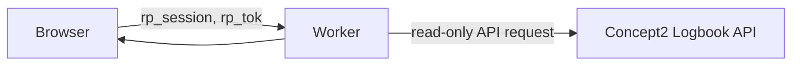

# Stateless Cloudflare Storage Removal — Design

## Data and session flow

`rp_session` is AES-GCM sealed with `SESSION_SECRET` and contains identity,
OAuth tokens when the optional OAuth flow is configured, and the home timezone.
`rp_tok` is a separate sealed httpOnly cookie for BYOT credentials. No Worker
binding, migration, or data module persists session or workout data.

## Read paths

- `loadWorkouts` follows `meta.pagination.total_pages` because dashboard
  analytics must see the entire history. A request-scoped `WeakMap` shares that
  promise among dashboard loaders.
- `pollRecentWorkouts` asks `Concept2Client.listRecentWorkouts(25)` for only
  the newest page. The client keeps its own seen-ID set and shows only new rows.
- Replay detail and export are live API reads; demo mode stays deterministic.

## Preferences

- Annual goals use a short JSON `annual_goal` httpOnly cookie. Authenticated
  values contain the owner ID; demo values do not cross into signed-in mode.
- The timezone is part of `rp_session`, validated by `Intl.DateTimeFormat`,
  and remains editable on `/settings`.
- `/settings` is intentionally narrow: export and timezone only. It does not
  expose removed cache, sync, or deletion operations.

## Removed surface area

Storage-era modules, migrations, components, and tests are removed rather than
left as dead compatibility code. A small set of retired routes returns `410`
for old clients; removed pages redirect to an available screen. Legacy public
ghost-token fetches are not attempted by the replay UI.

## Privacy and failure behavior

- Responses containing authenticated data use `private, no-store`.
- Invalid/tampered cookies result in a reconnect path instead of a server
  lookup.
- Concept2 API failures leave the dashboard renderable with an empty/error
  state and make live mode back off.
