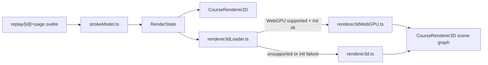

# Design Document: WebGPU-First Replay Graphics Upgrade

## Overview

The replay graphics upgrade has two independent axes:

1. A WebGPU-first 3D backend that loads lazily, initializes asynchronously, and
   falls back to the existing WebGL renderer when needed.
2. A Concept2-derived stroke model that gives 2D, WebGL 3D, and WebGPU 3D the
   same recorded-stroke pose envelope.

The UI remains intentionally simple: users choose `2D` or `3D`, plus quality.
The active backend is only surfaced as diagnostics because backend choice is an
implementation detail.

## Flow

## Stroke model

`src/lib/replay/strokeModel.ts` is a pure, DOM-free module. It owns the
conversion from Concept2 stroke rows to replay poses:

- Normalize `t` and `d` into a monotonic timeline, including interval resets.
- Estimate each stroke interval from adjacent timestamps, SPM, and distance per
  stroke.
- Derive a drive/recovery envelope from stroke duration, rate, and power.
- Produce accents for catch and finish so renderers can align splash, blade
  puddles, pole plants, and pedal surges to recorded stroke boundaries.
- Carry intensity and fatigue signals from watts, pace, heart rate, and changing
  stroke rhythm.
- Fall back to synthetic split-derived poses for workouts without real stroke
  rows.

The model deliberately avoids claims that Concept2's public stroke endpoint does
not support. It does not reconstruct force curves, handle position, drag factor,
or per-sample force data.

## Renderer state

`RenderState` now accepts:

- `strokePose?: StrokePose`
- `ghostStrokePose?: StrokePose`

The replay page builds one timeline for the live workout and one for the selected
ghost. On every sampled frame it asks `strokePoseAt(...)` for the live and ghost
poses, then passes those poses into the selected renderer.

Both 2D and 3D renderers treat the pose as authoritative when it exists. The old
distance-based phase remains only as a fallback for synthetic or missing data.
Catch effects are emitted from `catchTransitions`, which prevents visual effects
from drifting away from the recorded stroke rows.

## WebGPU-first factory

`src/lib/replay/renderer3dLoader.ts` is the single entry point for 3D renderer
creation. It is responsible for:

- SSR-safe capability checks.
- WebGPU runtime feature detection.
- Lazy `three/webgpu` import only when WebGPU might be used.
- Awaiting `renderer.init()` before accepting the WebGPU backend.
- Falling back to WebGL on unsupported browsers or WebGPU init failure.
- Returning backend diagnostics to the replay page.

`src/lib/replay/renderer3dWebGPU.ts` keeps the WebGPU-specific import boundary
small. It subclasses the existing `CourseRenderer3D` scene graph and overrides
renderer construction with `WebGPURenderer`, so the sport environments, avatars,
wake, spray, ghost lane, camera, and governor behavior remain shared.

## Ultra quality

`RenderQuality` adds `ultra`, but WebGL treats it as `high`. WebGPU-capable
devices can use:

- A higher DPR cap under governor control.
- Larger shadow map budget.
- Denser water, snow, and track geometry.
- More wake samples.
- More instanced spray and buoy detail.
- A larger 3D stage in the replay layout.

The performance governor still owns degradation. Ultra should look richer on
premium hardware, but it must degrade gracefully when frame budgets are missed or
reduced motion is active.

## Sport environments

The upgrade extends the existing sport-aware renderer rather than creating
separate renderers:

- **RowErg**: richer water surface, layered lane lines, buoy/distance markers,
  blade puddles, wake, and buoys.
- **SkiErg**: snow-colored ground, groomed course grooves, blue gate markers,
  pole plant accents, and plume-style spray.
- **BikeErg**: velodrome/asphalt treatment with red/white curbs, dashed lane
  marks, speed bars, pedal-cycle body motion, and distance-scaled camera
  treatment.

## Athlete realism pass

The 3D avatar should no longer read as a toy-like marker. RowErg, SkiErg, and
BikeErg now share a lightweight human modelling language:

- Segmented bodies with separate torso, hips, shoulders, neck, head, hair/helmet,
  upper/lower limbs, hands, feet, and sport-specific kit.
- Capsule and ellipsoid geometry instead of boxy torso/limb blocks.
- Neutral skin/kit materials with the lane accent used as equipment and jersey
  detail, not as a single solid-colour body.
- A closer, lower chase camera so body posture and stroke mechanics are legible
  in the replay stage and mobile viewport.

## Diagnostics and UI

The replay controls keep the same mental model:

- Mode: `2D / 3D`
- Quality: existing quality selector plus `Ultra`
- Backend: read-only diagnostics label once the 3D renderer has initialized

This keeps WebGPU discoverable for debugging without turning rendering internals
into user-facing configuration.

## Reduced motion

Reduced motion suppresses decorative animation and particle effects across both
backends. Static avatars, course lines, gauges, and charts remain visible. The
stroke model still computes poses so the replay state stays deterministic, but
renderers do not emit splash, spray, plume, surge, wave displacement, or FOV zoom
when reduced motion is active.

## Files changed

| File                                      | Change                                                   |
| ----------------------------------------- | -------------------------------------------------------- |
| `src/lib/replay/strokeModel.ts`           | New Concept2-derived stroke timeline and pose model      |
| `src/lib/replay/strokeModel.test.ts`      | New unit tests for stroke rows, fallback, and catch math |
| `src/lib/replay/replayRenderer.ts`        | `ultra` preference support                               |
| `src/lib/replay/replayRenderer.test.ts`   | Quality persistence coverage                             |
| `src/lib/replay/renderer.ts`              | 2D `StrokePose` consumption and catch-triggered effects  |
| `src/lib/replay/renderer.test.ts`         | 2D pose/no-throw coverage                                |
| `src/lib/replay/renderer3d.ts`            | Shared WebGL/WebGPU scene graph, pose input, ultra tier  |
| `src/lib/replay/renderer3d.test.ts`       | 3D pose, ultra, and governor coverage                    |
| `src/lib/replay/renderer3dLoader.ts`      | WebGPU-first factory with WebGL fallback                 |
| `src/lib/replay/renderer3dLoader.test.ts` | Capability, init-failure, fallback, and SSR tests        |
| `src/lib/replay/renderer3dWebGPU.ts`      | Lazy `three/webgpu` renderer entry                       |
| `src/routes/replay/[id]/+page.svelte`     | Live/ghost stroke timelines, backend diagnostics, stage  |
| `docs/usage.md`                           | Public replay graphics documentation                     |
| `README.md`                               | Replay summary update                                    |
| `src/lib/locales/*.ts`                    | Localized guide and labels                               |
| `.kiro/steering/structure.md`             | Replay module inventory update                           |
