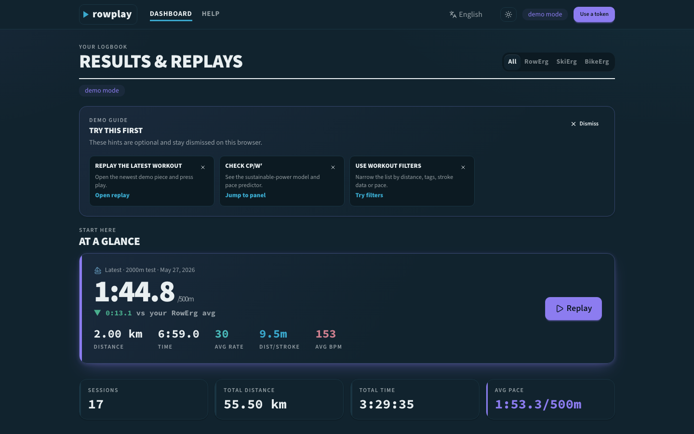
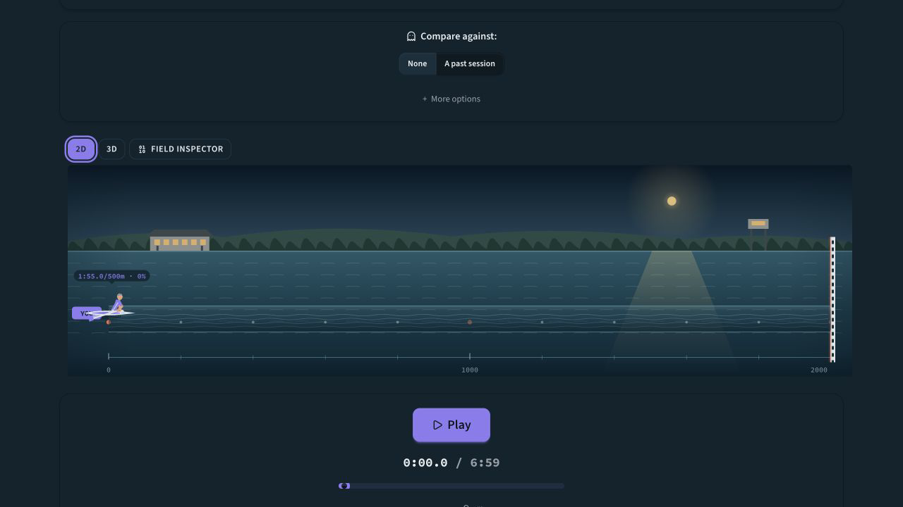
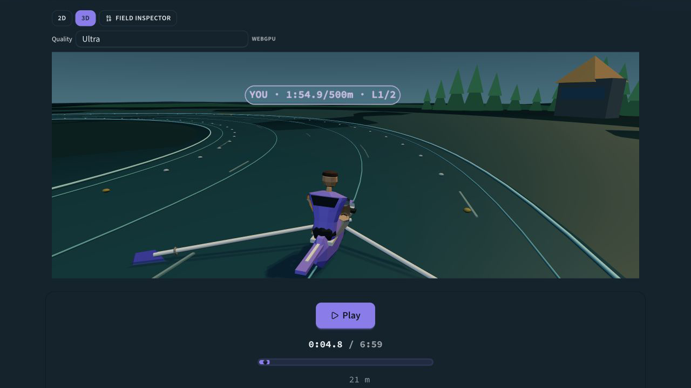

# rowplay

Post-workout Concept2 logbook analytics and synchronized 2D/3D replay for
RowErg, SkiErg, and BikeErg sessions.

[](https://github.com/shenghaoc/rowplay/actions/workflows/ci.yml)

rowplay turns workouts already uploaded to the Concept2 Logbook into a
full-history training dashboard and an interactive replay. It reads the
Logbook rather than connecting directly to a PM5, and it does not keep a
server-side copy of workout history.

**[Launch the production demo](https://rowplay.shenghaoc.workers.dev/dashboard)**
— no account or credentials required.

The canonical user guide is [docs/usage.md](docs/usage.md) and is rendered in
the app under `/docs`.

## Demo screenshots

### Dashboard



### Replay

#### 2D regatta venue



#### 3D regatta venue



The replay combines an illustrative sport venue with stroke-synchronised
athletes and telemetry. Screenshots use bundled synthetic demo workouts; no
private Concept2 data or real-world route imagery is shown.

## Try the demo

The hosted demo opens with deterministic sample history and exercises the
dashboard and replay without contacting a real account:

**[Open rowplay demo](https://rowplay.shenghaoc.workers.dev/dashboard)**

To run the same demo locally:

```bash
git clone https://github.com/shenghaoc/rowplay.git
cd rowplay
vp install
vp dev
```

Open `http://localhost:5173/dashboard`, choose a bundled workout, and start its
replay. Demo mode needs no `.dev.vars`, Concept2 account, or Cloudflare
account.

## Current highlights

### Training dashboard

- Complete paginated Logbook history for authenticated athletes
- RowErg, SkiErg, and BikeErg filters, totals, pace trends, and progress views
- Personal bests, annual goals, and a year-at-a-glance training calendar
- Fitness, fatigue, form, critical-power, and stroke-efficiency analysis
- Responsive workout lists and charts for desktop and mobile

### Synchronized replay

- Play, pause, scrub, and 0.5×–8× playback controls
- Concept2 stroke-based animation that aligns one cycle to each valid moving
  stroke row, with cadence-continuous split or summary timing when detail is
  unavailable
- Canvas 2D and optional Three.js 3D renderers that share staged RowErg,
  SkiErg, and BikeErg kinematics, equipment contact targets, and sport-specific
  water, snow, and track materials
- Premium sport-specific environments in both views: layered regatta water and
  shoreline, groomed Nordic snow and alpine venue cues, or a barrier-lined
  asphalt/velodrome training circuit
- A compact repository-owned low-poly GLB supplies authored athlete and
  sport-equipment shells in 3D; the existing contact-driven rig owns motion,
  while Canvas 2D and procedural 3D geometry remain reliable fallbacks
- Generic replay figures only—no scan, athlete likeness, avatar-generator
  output, user image, or undocumented downloaded model
- Local procedural scenery built from Canvas drawing and Three.js geometry;
  no generated environment images, scanned venues, or downloaded location
  models are shipped in the replay runtime
- Alias-resistant 2D BikeErg drivetrain motion with explicit cranks, pedals,
  chain and directional wheel markers that remain readable through 8× playback
- Progressive 3D fallback from WebGPU to WebGL, then to the stable 2D renderer
- Live pace, rate, power, heart-rate, and synchronized telemetry charts
- Personal ghost racing against a comparable past session or target pace
- Workout-moment analysis with direct jumps to meaningful sections

### Athlete tools and platform

- Full-history CSV and JSON export, plus per-workout TCX where supported
- Near-live polling for newly logged Concept2 results
- English, Deutsch, Español, Français, 日本語, and 中文
- Installable PWA, responsive layouts, dark/light themes, and a credential-free
  demo backed by deterministic bundled history

### Current scope

rowplay is private and read-only by design. It does not offer public replay
links, leaderboards, the retired side-by-side `/compare` workflow, persistent
coaching annotations or manual tags, server-side heart-rate merging,
sync/backfill, account-data deletion, or write-back to Concept2.

## Architecture

```text
Browser
  ├── receives rendered SvelteKit pages and client assets
  ├── keeps theme and language preferences
  ├── sends sealed cookies automatically
  └── holds no JavaScript-readable Concept2 token
             │
             ▼
Cloudflare Worker / SvelteKit server
  ├── validates and encrypts session cookies
  ├── reads Concept2 data live for authenticated requests
  ├── memoizes duplicate full-history loads within one request
  ├── serves bundled demo history without credentials
  └── has no KV, D1, or server-side workout database
             │
             ▼
Concept2 Logbook API
  └── remains the source of truth for workout history and detail
```

The Worker temporarily processes workout data while answering a request but
does not persist it. The personal token is sealed into an httpOnly `rp_tok`
cookie, so browser JavaScript cannot read the raw credential. Authenticated
workout and export responses containing personal data are served as private,
non-cacheable responses. Logging out clears both authentication cookies, and
demo mode never contacts a real athlete account.

### Engineering decisions

- A stateless Worker reduces cross-user persistence risk and removes database
  migrations, persistent user-data bindings, and server workout-cache
  invalidation from operations.
- Full-history views follow Concept2 pagination; concurrent loaders in the same
  request share one live read.
- Near-live polling asks only for the newest results page instead of reloading
  an athlete's entire history.
- Replay uses detailed stroke rows when possible and degrades to split or
  summary timing when Concept2 has less detail.
- 3D rendering progressively falls back from WebGPU to WebGL to the stable 2D
  renderer.
- Bundled synthetic history makes development and evaluation reproducible
  without credentials.

## Connecting a Concept2 account

Production is bring-your-own-token (BYOT) first:

1. Get a personal Concept2 API token from the
   [Logbook Applications page](https://log.concept2.com/profile/applications).
2. Submit it to rowplay at `/auth/token`.
3. The Worker validates it against Concept2 and seals it into the httpOnly
   `rp_tok` cookie.
4. Authenticated pages use that credential only for server-side, read-only
   Concept2 API requests.

The app fetches authenticated history and replay detail live; there is no
persistent server-side sync, warm-up, backfill, or authenticated workout cache.
Optional OAuth support remains available for self-hosters with a registered
Concept2 developer application, but it is not required for BYOT.

## Privacy model

- **`rp_tok`** — the personal BYOT credential, AES-GCM sealed with
  `SESSION_SECRET` in an httpOnly cookie. It is not placed in localStorage or a
  Worker database.
- **`rp_session`** — a separate sealed httpOnly cookie containing identity,
  optional OAuth credentials, and the selected home timezone.
- **`annual_goal`** — an httpOnly preference cookie; authenticated goals are
  scoped to the athlete ID so they do not follow a logout/login transition to
  another account.
- **Workout data** — read live from Concept2 and held only while the Worker
  handles a request. Concept2 remains the persistent source of truth.
- **Demo data** — bundled synthetic history is served locally without a
  Concept2 credential or real account request.
- **Logout** — clears both `rp_tok` and `rp_session`.
- **Logging** — server code uses a redacting logger and avoids intentionally
  emitting personal tokens, cookie values, sensitive profile data, or full
  workout payloads.

## Local development

|                      | `vp dev`                        | `vp run preview`                         |
| -------------------- | ------------------------------- | ---------------------------------------- |
| URL                  | `http://localhost:5173`         | `http://127.0.0.1:8787`                  |
| Runtime              | Fast Vite/SvelteKit development | Build plus `wrangler dev`                |
| Workers fidelity     | No                              | Yes                                      |
| Demo UI              | Yes                             | Yes                                      |
| BYOT/session testing | Not production-faithful         | Correct local runtime shape              |
| Use for              | UI, charts, demo, components    | Auth, cookies, server routes, live reads |

`vp run preview` does not require a KV namespace, D1 database, migration, or
seed step.

For local token authentication:

```bash
cp .dev.vars.example .dev.vars
# Set SESSION_SECRET in .dev.vars
vp run preview
```

Then open `http://127.0.0.1:8787/auth/token`. Never commit `.dev.vars` or a
personal token.

## Self-hosting

1. Create a Cloudflare account, then fork and clone the repository.
2. Install dependencies with `vp install`.
3. Set `vars.PUBLIC_APP_URL` in `wrangler.jsonc` to the deployed origin.
4. Configure the cookie-encryption secret:

   ```bash
   wrangler secret put SESSION_SECRET
   ```

5. For optional OAuth, set `vars.CONCEPT2_CLIENT_ID` and configure
   `CONCEPT2_CLIENT_SECRET` with `wrangler secret put`. Leave both unset for
   the recommended BYOT-only deployment.
6. Verify the checkout:

   ```bash
   vp run check
   vp run validate:locales
   vp run test:e2e:smoke
   ```

7. Deploy the Worker and its static assets:

   ```bash
   vp run deploy
   ```

The Worker needs no persistent storage resource or database provisioning.

## Commands

| Command                   | Purpose                                                            |
| ------------------------- | ------------------------------------------------------------------ |
| `vp install`              | Install the locked dependency set                                  |
| `vp dev`                  | Fast local Vite/SvelteKit development on port 5173                 |
| `vp build`                | Build the Cloudflare Worker and static assets                      |
| `vp run preview`          | Build and run the Workers-faithful local preview                   |
| `vp run preview:wrangler` | Run `wrangler dev` after an existing build                         |
| `vp run format`           | Format the repository                                              |
| `vp run format:check`     | Check formatting without writing                                   |
| `vp lint`                 | Run lint and fail on findings                                      |
| `vp run typecheck`        | Run SvelteKit sync, `svelte-check` (TS 6), and TS 7 `tsc --noEmit` |
| `vp test`                 | Run the Node-environment Vitest suite                              |
| `vp run test:browser`     | Run Vitest Browser Mode in Chromium                                |
| `vp run test:e2e`         | Run all Playwright desktop and mobile scenarios                    |
| `vp run test:e2e:smoke`   | Run the Chromium desktop pull-request smoke suite                  |
| `vp run validate:locales` | Verify key parity across all six locale dictionaries               |
| `vp run check`            | Format check, lint, typecheck, Vitest, and production build        |
| `vp run deploy`           | Build and deploy to Cloudflare Workers                             |

For Browser Mode and E2E on a fresh machine, install Chromium once:

```bash
vpx playwright install --with-deps chromium
```

## Project layout

```text
src/
  components/       reusable charts, gauges, panels, and controls
  lib/
    analytics.ts    pure dashboard and training analysis
    mockData.ts     bundled synthetic demo history
    replay/         engine, 2D/3D renderers, sources, and ghost helpers
    server/         live Concept2, cookie session, export, data, and logging
  routes/
    auth/           BYOT entry and optional OAuth callbacks
    api/            live reads, export, goals, timezone, and recent polling
    dashboard/      full-history analytics and workout list
    replay/[id]/    synchronized workout replay
    settings/       export and home-timezone controls
    docs/           localized user guide
```

Historical compatibility handlers for removed features are intentionally
omitted from this active-product map.

## Known limitations

- Authenticated pages depend on the Concept2 API and network availability.
- Very large histories can take longer because the Worker reads live,
  paginated data rather than a persistent local cache; Concept2 rate limits can
  also delay refreshes.
- Not every Logbook result includes per-stroke data, so some replays use splits
  or summary timing.
- 3D replay needs WebGPU or WebGL; devices without either use the 2D renderer.
- Live mode polls for newly logged results rather than receiving push updates.
- One BYOT session represents one Concept2 athlete.
- rowplay reads the Concept2 Logbook after upload and does not connect directly
  to a PM5.
- Public sharing, leaderboards, persistent annotations, and server-side
  heart-rate merging are not part of the stateless product.

## Stack

| Concern                   | Choice                                                  |
| ------------------------- | ------------------------------------------------------- |
| App framework             | SvelteKit / Svelte 5 with Vite                          |
| Hosting                   | Cloudflare Workers with static assets                   |
| Authentication            | BYOT and AES-GCM sealed httpOnly cookies                |
| Workout data              | Live Concept2 Logbook API reads                         |
| Persistent Worker storage | None                                                    |
| Charts                    | [uPlot](https://github.com/leeoniya/uPlot)              |
| 3D                        | Three.js, WebGPU first with WebGL fallback              |
| UI                        | daisyUI 5 / Tailwind CSS 4                              |
| Internationalization      | Repository dictionaries for six languages               |
| Testing                   | Vitest, Vitest Browser Mode, and Playwright             |
| CI                        | GitHub Actions with repository, locale, and smoke gates |

## Contributing

See [AGENTS.md](AGENTS.md) for the contributor entry point and links to the
repository's steering documents, skills, and implementation specifications.

- [Bug report template](.github/ISSUE_TEMPLATE/bug_report.md)
- [Feature request template](.github/ISSUE_TEMPLATE/feature_request.md)
- [Security policy](SECURITY.md)

Not affiliated with Concept2. "Concept2", "RowErg", "SkiErg", and "BikeErg"
are trademarks of Concept2.
